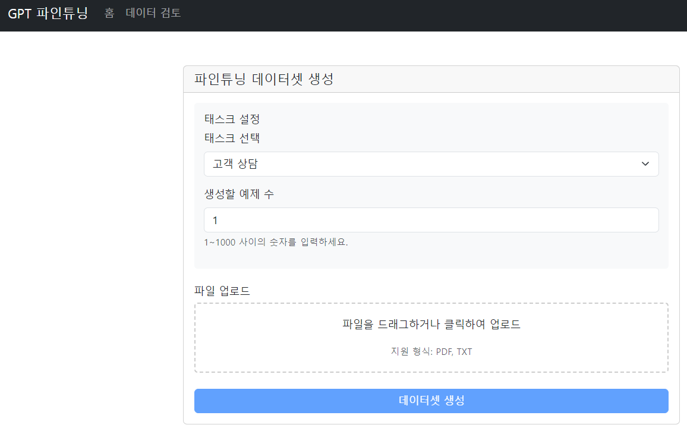
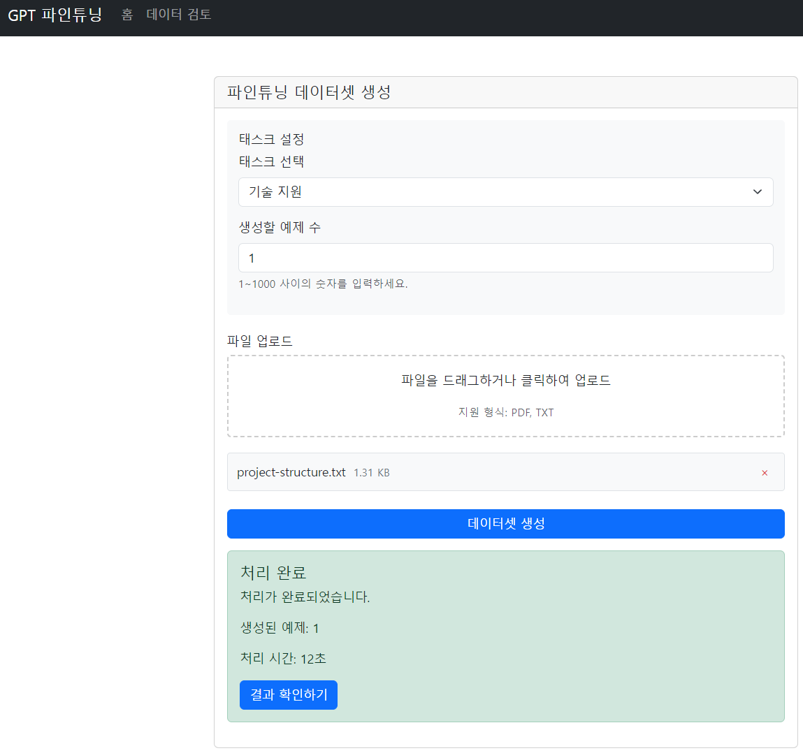
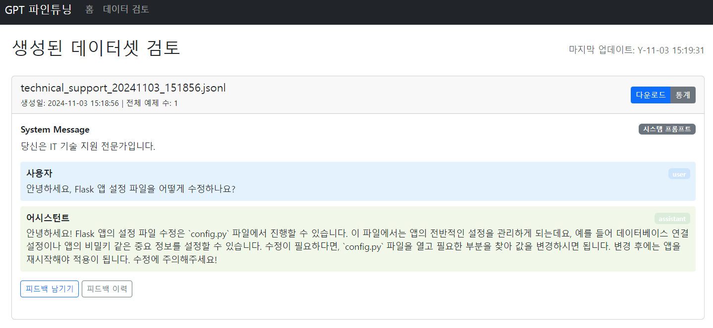

# KoGPT-Labeler
LlamaIndex와 OpenAI를 활용한 ChatGPT 파인튜닝용 한국어 데이터셋 자동 생성 및 품질 관리 시스템

## 프로젝트 개요
KoGPT-Labeler는 한국어 ChatGPT 파인튜닝을 위한 대규모 데이터셋을 자동으로 생성하고 품질을 관리하는 시스템입니다. 다양한 도메인의 문서를 입력받아 고품질의 데이터셋을 생성하고, 생성된 데이터의 품질을 자동으로 검증하며, 사람이 검토할 수 있는 통합 플랫폼을 제공합니다.

### 주요 기능
1. 문서 처리 및 데이터 추출
   - PDF, TXT 등 다양한 형식의 문서 지원
   - 한글 파일명 지원
   - 멀티파일 업로드 처리
   - 청크 단위 문서 분할
2. 데이터셋 생성
   - LlamaIndex를 통한 문서 인덱싱
   - OpenAI Embedding을 활용한 의미 기반 검색
   - GPT-4 Turbo 기반 대화 데이터 생성
   - ChatGPT 파인튜닝 포맷(JSONL) 지원
3. 품질 관리
   - 자동화된 품질 메트릭 측정
   - 한글 비율 검증 (30% 이상)
   - 텍스트 길이 및 형식 검증
   - 개인정보필터링
   - 중복 검사
4. 피드백 시스템
   - 인간 검토자 피드백 입력
   - 품질 평가 점수화
   - 이슈 태깅
   - 피드백 이력 관리
   - 통계 분석
5. 웹 인터페이스
   - 직관적인 파일 업로드
   - 실시간 진행 상황 모니터링
   - 데이터셋 검토 및 다운로드
   - 품질 통계 시각화

### 향후 업데이트 기능
   - 훈련 및 검증 데이터 8:2 분할
   - 다양한 태스크 발굴
   - 현재 임베딩 시 고품질 데이터 출력을 위해 OpenAI Embedding 활용하는데 추후 비용 이슈로 인해 국내 임베딩 모델 도입
   - 데이터셋 생성 시 GPT 이외 다른 LLM 선택 가능하도록
   - 한국어 특화 전처리 기능
   

### 개발 환경
#### 시스템 요구사항
   - Windows 11 또는 Linux
   - Python 3.11 이상
   - CUDA 지원 GPU

#### 주요 프레임워크 및 라이브러리
   - requirements.txt 참고